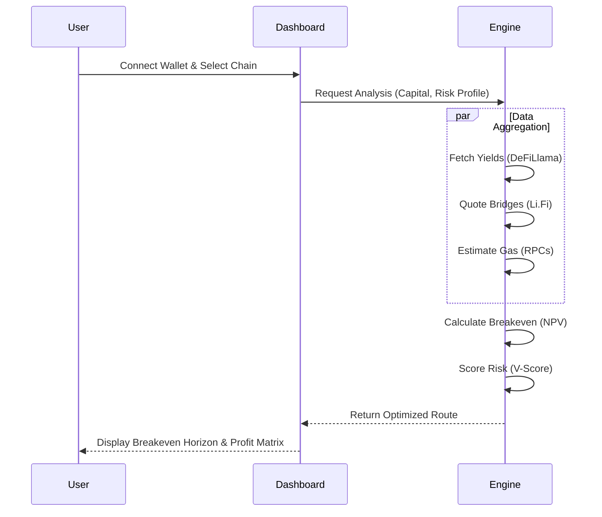
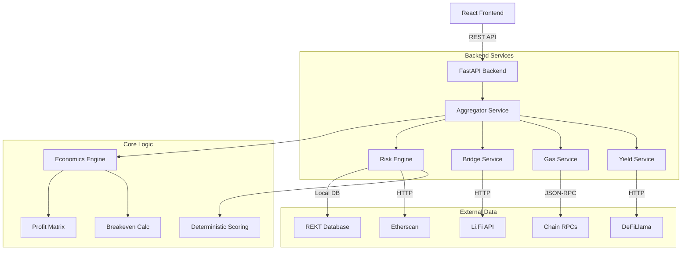

# 💧 Liquidity Vector

**The Intelligent DeFi Decision Engine.**  
Optimize cross-chain capital allocation with real-time breakeven analysis, deterministic risk scoring, and a human-centered minimalist interface.

[](https://opensource.org/licenses/MIT)
[](https://nextjs.org/)
[](https://fastapi.tiangolo.com/)
[](https://www.docker.com/)
[](https://github.com/RahilBhavan/liquidityvector_gemini/actions)

---

## 🎯 Value Proposition

In the fragmented DeFi landscape, yield arbitrage is often a "friction trap." Higher APYs on distant chains are frequently offset by gas fees, bridge tolls, slippage, and the opportunity cost of time. 

**Liquidity Vector** provides institutional-grade clarity, answering the binary question: *"Will this rotation result in a net profit within my specific time horizon?"*



---

## ✨ Core Innovations

### 📈 Multi-Dimensional Breakeven Engine
Moves beyond simple APY comparison to calculate the exact **Breakeven Horizon**.
- **Round-Trip Accounting**: Factors in both entry AND exit costs (often ignored by competitors).
- **Proportional Scaling**: Automatically adjusts bridge fees vs. gas costs based on user capital size.
- **Dynamic Charting**: Visualizes profit trajectory using high-performance Area Charts.

### 🛡️ Rigorous Risk Scoring (V-Score)
A deterministic 1-100 security rating based on 6 weighted quantitative and qualitative factors:
- **Bridge Architecture (25%)**: Prioritizes Canonical and Intent-based systems.
- **Protocol Maturity (20%)**: Factors in the Lindy Effect and mainnet uptime.
- **Liquidity Depth (20%)**: Evaluates TVL robustness against slippage.
- **Exploit History (20%)**: Heavy penalties for historical security incidents (linked to REKT database).
- **Contract Verification (10%)**: Automated verification checks via block explorers.
- **Network Stability (5%)**: Maturity of the underlying chain.

### 🍏 Apple-Inspired Minimalist UX
A radical departure from high-noise DeFi dashboards. 
- **Focus**: Generous whitespace and glassmorphism to reduce cognitive load.
- **Empathy**: Professional "Technical Dossiers" explain security risks in human language.
- **Snappy Iteration**: Optimized for sub-second data refreshes and instant UI feedback.

---

## 🏗️ Technical Architecture

### **System Design**


### **The Engine (Backend: Python/FastAPI)**
- **Async Aggregator**: Concurrently queries multiple RPC nodes and bridge APIs (Li.Fi) using `asyncio` for sub-second analysis.
- **Economic Model**: Implements vectorized profitability matrices to simulate 30+ scenarios (Time x Capital) instantly.
- **Resilience Layer**: Robust circuit breakers and TTL caching to handle blockchain RPC instability.

### **The Interface (Frontend: Next.js/React)**
- **Real-time Visualization**: High-performance Area Charts (Recharts) showing profit accumulation zones.
- **Web3 Ready**: Integrated with **RainbowKit** and **Wagmi** for seamless wallet connectivity and chain synchronization.
- **Vibe Coding Workflow**: Built using high-level architectural direction and rapid AI-assisted iteration cycles.

---

## 🚀 Quick Start

### **Prerequisites**
- Docker & Docker Compose
- Node.js 20+ (for manual setup)
- Python 3.11+ (for manual setup)

### **Docker Deployment (Recommended)**
The simplest way to run the full production-ready stack:
```bash
docker-compose -f docker-compose.prod.yml up -d --build
```
- **Frontend**: [http://localhost:3000](http://localhost:3000)
- **API (Swagger)**: [http://localhost:8000/docs](http://localhost:8000/docs)

### **Manual Development Setup**

1. **Clone & Install**
   ```bash
   git clone https://github.com/RahilBhavan/liquidityvector_gemini.git
   cd liquidityvector_gemini
   npm install
   ```

2. **Backend API**
   ```bash
   cd api
   python -m venv venv
   source venv/bin/activate
   pip install -r requirements.txt
   uvicorn main:app --reload --port 8000
   ```

3. **Frontend UI**
   ```bash
   # In root directory
   npm run dev
   ```

---

## 🔧 Environment Configuration

Create a `.env.local` (Frontend) and `api/.env` (Backend) based on the provided `.env.example` templates.

| Variable | Description |
| :--- | :--- |
| `NEXT_PUBLIC_GEMINI_API_KEY` | Google Gemini API key for AI-powered advisory. |
| `ALLOWED_ORIGINS` | CORS whitelist for the API (default: localhost:3000). |
| `RPC_URL_*` | (Optional) Custom RPC endpoints for improved gas accuracy. |

---

## 📁 Project Organization

- **`/api`**: FastAPI server, orchestration services, and data providers.
- **`/app`**: React components, themes, and application routes.
- **`/core`**: Deterministic financial logic and risk scoring algorithms.
- **`/contracts`**: Solidity monitors for bridge health and registry management.
- **`/docs`**: In-depth [Project Analysis](./docs/PROJECT_ANALYSIS.md), [Economic Models](./docs/ECONOMIC_ANALYSIS_REPORT.md), and [Expansion Roadmap](./docs/EXPANSION_ROADMAP.md).

---

## 🧠 Methodology: Vibe Coding
This project is a showcase of the **Vibe Coding** philosophy—where the developer acts as a **Strategic Pilot**:
1. **Architectural Direction**: High-level system design and unique value propositions.
2. **AI-Assisted Navigation**: Utilizing advanced agents to handle boilerplate, CSS polish, and data normalization.
3. **Rapid Pivoting**: Demonstrating the agility to swap entire design systems and refactor core scoring math in minutes, not days.

---

## 🔮 Future Roadmap
- **P0**: Integrated One-Click Bridging (via Li.Fi Widget).
- **P1**: Automated "Vector Alerts" via Telegram/Email.
- **P2**: On-Chain Risk Oracle for 3rd-party protocol consumption.

See the full [Expansion Roadmap](./docs/EXPANSION_ROADMAP.md) for more.

---

## 🙏 Acknowledgments
- **DeFiLlama** for institutional-grade yield data.
- **Li.Fi** for cross-chain bridge aggregation.
- **RainbowKit** for the world-class wallet experience.

---

<div align="center">
  <strong>Optimizing DeFi, one rotation at a time.</strong>
</div>
