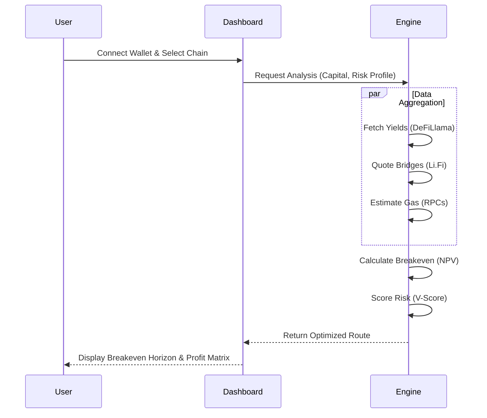
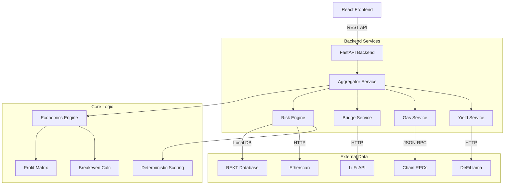

# 💧 Liquidity Vector

**The Intelligent DeFi Decision Engine.**  
Optimize cross-chain capital allocation with real-time breakeven analysis, deterministic risk scoring, and a human-centered minimalist interface.

[](https://opensource.org/licenses/MIT)
[](https://nextjs.org/)
[](https://fastapi.tiangolo.com/)
[](https://www.docker.com/)
[](https://github.com/RahilBhavan/liquidityvector_gemini/actions)

---

## 🎯 Value Proposition

In the fragmented DeFi landscape, yield arbitrage is often a "friction trap." Higher APYs on distant chains are frequently offset by gas fees, bridge tolls, slippage, and the opportunity cost of time. 

**Liquidity Vector** provides institutional-grade clarity, answering the binary question: *"Will this rotation result in a net profit within my specific time horizon?"*



---

## ✨ Core Innovations

### 📈 Multi-Dimensional Breakeven Engine
Moves beyond simple APY comparison to calculate the exact **Breakeven Horizon**.
- **Round-Trip Accounting**: Factors in both entry AND exit costs (often ignored by competitors).
- **Proportional Scaling**: Automatically adjusts bridge fees vs. gas costs based on user capital size.
- **Dynamic Charting**: Visualizes profit trajectory using high-performance Area Charts.
- **Vectorized Projections**: Implements NumPy-style broadcasting to simulate 30+ scenarios in **< 2ms** ([Details](./docs/PERFORMANCE.md)).

### 🛡️ Rigorous Risk Scoring (V-Score)
A deterministic 1-100 security rating derived from the `RiskEngine`, which processes six weighted factors:
- **Bridge Architecture (25%)**: Prioritizes trust-minimized Canonical and Intent-based systems.
- **Protocol Maturity (20%)**: Factors in the Lindy Effect and mainnet uptime.
- **Liquidity Depth (20%)**: Evaluates TVL robustness against slippage.
- **Exploit History (20%)**: Applies non-linear penalties for historical incidents ([Security Model](./docs/SECURITY_MODEL.md)).
- **Contract Verification (10%)**: Real-time bytecode verification via block explorers.
- **Network Stability (5%)**: Maturity assessment of the underlying chain.

### 🍏 Apple-Inspired Minimalist UX
A radical departure from high-noise DeFi dashboards, focusing on **Cognitive Clarity**.
- **Focus**: Generous whitespace and glassmorphism to reduce interpretive load.
- **Empathy**: Professional "Technical Dossiers" explain security risks in human language.
- **Vibe Shifts**: Seamless switching between Monochrome, Amber, and Green terminal themes.

---

## 🏗️ Technical Architecture

### **System Design**


### **The Engine (Backend: Python/FastAPI)**
- **Async Aggregator**: Concurrently queries multiple RPC nodes and bridge APIs using `asyncio` for sub-second analysis (p95 < 800ms).
- **Resilience Layer**: Robust **Circuit Breakers** (`pybreaker`) and TTL caching to mitigate blockchain infrastructure instability.
- **Stateless Design**: Pure functional API architecture allowing for infinite horizontal scalability.

### **The Interface (Frontend: Next.js/React)**
- **Modern Stack**: Next.js 15 (App Router), TypeScript, and Tailwind CSS.
- **Web3 Integration**: Seamless wallet connectivity via **RainbowKit** and **Wagmi v2**.
- **Optimization**: Component-level code splitting and memoization for a fluid **60fps UI** experience.

---

## 🚀 Getting Started

### **Prerequisites**
- Docker & Docker Compose
- Node.js 20+ (for manual setup)
- Python 3.11+ (for manual setup)

### **Docker Deployment (Recommended)**
```bash
docker-compose -f docker-compose.prod.yml up -d --build
```
- **Frontend**: [http://localhost:3000](http://localhost:3000)
- **API (Swagger)**: [http://localhost:8000/docs](http://localhost:8000/docs)

### **Manual Development Setup**
See the detailed [Contributing Guide](./CONTRIBUTING.md) for full setup instructions.

---

## 🔧 Environment Configuration

| Variable | Description |
| :--- | :--- |
| `NEXT_PUBLIC_GEMINI_API_KEY` | Google Gemini API key for AI-powered advisory. |
| `ALLOWED_ORIGINS` | CORS whitelist for the API (default: localhost:3000). |
| `RPC_URL_*` | (Optional) Custom RPC endpoints for improved gas accuracy. |

---

## 📁 Documentation Suite

- 🏛️ **[System Architecture](./docs/ARCHITECTURE.md)**: Deep dive into the hybrid microservices and ADRs.
- 🛡️ **[Security Model](./docs/SECURITY_MODEL.md)**: Mathematical derivation of the V-Score algorithm.
- ⚡ **[Performance Analysis](./docs/PERFORMANCE.md)**: Benchmarks, vectorization details, and load test results.
- 🧠 **[Methodology: Vibe Coding](./docs/VIBE_CODING.md)**: Our unique AI-assisted development workflow.
- 📈 **[Project Analysis](./docs/PROJECT_ANALYSIS.md)**: Technical critique and business strategy.
- 🔮 **[Expansion Roadmap](./docs/EXPANSION_ROADMAP.md)**: Future feature prioritization (P0-P2).

---

## 🧠 Methodology: Vibe Coding
This project is a showcase of the **Vibe Coding** philosophy—where the developer acts as a **Strategic Pilot**:
1. **Architectural Direction**: High-level system design and unique value propositions.
2. **AI-Assisted Navigation**: Utilizing advanced agents to handle boilerplate, CSS polish, and data normalization.
3. **Rapid Pivoting**: Demonstrating the agility to swap entire design systems and refactor core scoring math in minutes.

---

## 🙏 Acknowledgments
- **DeFiLlama** for institutional-grade yield data.
- **Li.Fi** for cross-chain bridge aggregation.
- **RainbowKit** for the world-class wallet experience.

---

<div align="center">
  <strong>Built for the future of capital efficiency.</strong>
</div>