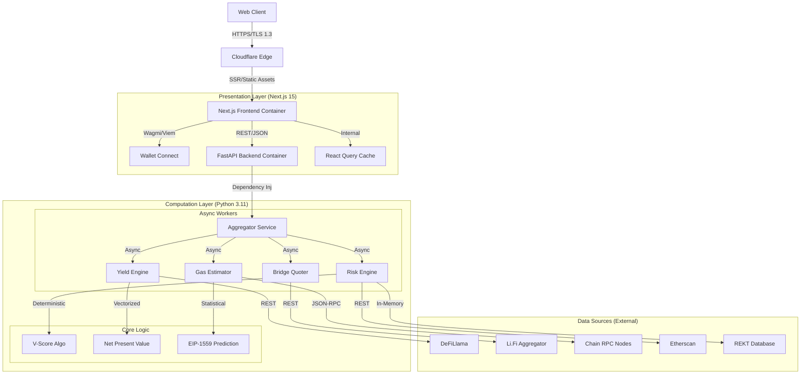

# System Architecture

## 1. Overview
Liquidity Vector employs a **Hybrid Microservices Architecture** designed for high-frequency financial analysis. It explicitly separates the computation-heavy simulation engine (Python) from the interactive, client-heavy presentation layer (Next.js). This separation of concerns allows for independent scaling, optimized technology choices for specific workloads, and a robust security posture.

---

## 2. 🏗️ High-Level Design Topology

---

## 3. 🔧 Core Components Deep Dive

### 3.1 Frontend (The Interface)
*   **Framework**: Next.js 15 (App Router) utilizing React Server Components (RSC) for initial shell rendering.
*   **Rendering Strategy**: 
    *   **Streaming SSR**: The dashboard shell loads instantly (`<Suspense>`), while heavy data components (`Heatmap`, `Charts`) stream in as the backend processes them.
    *   **Client-Side Hydration**: Once loaded, the UI becomes fully interactive (CSR), allowing for zero-latency toggling of "Capital" and "Risk" parameters via local state.
*   **State Architecture**: 
    *   **Global**: `WagmiConfig` holds the wallet connection state and chain ID.
    *   **Server State**: `TanStack Query` (React Query) manages API responses, handling deduplication, background re-validation (stale-while-revalidate), and optimistic updates.
    *   **Ephemeral**: `useState` / `useReducer` handles UI interactions like modal toggles and input form values.

### 3.2 Backend (The Engine)
*   **Framework**: FastAPI (ASGI) running on Uvicorn workers.
*   **Concurrency Model**: Non-blocking I/O using Python's `asyncio` event loop. This allows a single worker to handle hundreds of concurrent "Analyze" requests, as most of the latency is waiting for external RPCs.
*   **Resilience Patterns**:
    *   **Scatter-Gather**: The `AggregatorService` fans out requests to 6+ external endpoints simultaneously. It gathers results using `asyncio.gather(return_exceptions=True)`, ensuring that one failed RPC doesn't crash the entire analysis—the system gracefully degrades to partial data.
    *   **Circuit Breaker**: Implemented via `pybreaker`. It monitors error rates from upstream providers (e.g., Li.Fi). If errors exceed 50% over a 60s window, the circuit "opens," failing fast and serving cached fallback estimates to protect system stability.
    *   **Vectorized Calculation**: The Profitability Matrix uses **NumPy-style broadcasting**. Instead of iterating through 30 capital/time scenarios ($O(N)$), it creates a capital vector and a time vector, then performs a single matrix operation to derive the net profit grid ($O(1)$ relative to Python loop overhead).

### 3.3 Data Flow Sequence (The "Analyze" Lifecycle)

1.  **Initiation**: User clicks "Fetch Data".
    *   *Frontend*: Sets `isFetching=true`, displays skeleton loaders.
2.  **Request**: `POST /analyze` with payload `{ capital: 5000, currentChain: "Ethereum", targetChain: "Arbitrum" }`.
3.  **Orchestration (Backend)**:
    *   *Parallel Execution*:
        *   **Gas Task**: Queries ETH Mainnet and Arbitrum One RPCs for `baseFee` + `priorityFee`. Applies a 1.2x variance buffer.
        *   **Bridge Task**: Queries Li.Fi for the optimal route (checking Stargate, Across, Hop). Extracts `estimatedGas` and `toolFee`.
        *   **Yield Task**: Queries DeFiLlama for the specific pool's current APY and TVL.
        *   **Risk Task**: Loads bridge metadata and runs the V-Score algorithm.
4.  **Synthesis**:
    *   `AggregatorService` waits for all tasks.
    *   **Breakeven Engine**: Calculates $T_{BE} = \frac{C_{total}}{Y_{daily}}$.
    *   **Matrix Engine**: Generates the 6x5 profitability grid.
5.  **Response**: JSON payload (~2kb) returned to client.
6.  **Rendering**: Frontend parses JSON, populates `BreakevenChart` (Recharts) and `Heatmap` instantly.

---

## 4. 🧠 Architectural Decision Records (ADR)

### ADR-001: Python vs. Node.js for Backend
*   **Status**: Accepted
*   **Context**: The application requires complex financial modeling (NPV, linear regression for gas predictions) and heavy data manipulation.
*   **Decision**: Use **Python (FastAPI)**.
*   **Consequences**:
    *   (+) Superior ecosystem for data science (Pandas, NumPy, Scikit-learn) required for Phase 2 features.
    *   (+) FastAPI's Pydantic models provide strict runtime type validation, critical for financial data.
    *   (-) Slightly higher memory footprint per container than Node.js.
    *   (-) Context switching for full-stack developers (TS <-> Python).

### ADR-002: Server-Side Rendering (SSR) for Dashboard
*   **Status**: Accepted
*   **Context**: DeFi dashboards often suffer from poor SEO and slow "First Contentful Paint" (FCP) due to massive client-side bundles.
*   **Decision**: Use **Next.js App Router**.
*   **Consequences**:
    *   (+) **Zero-Layout-Shift**: The dashboard shell is pre-rendered, eliminating CLS.
    *   (+) **Security**: API keys (e.g., Gemini) are kept server-side during the initial handshake.
    *   (+) **Performance**: Sensitive logic is executed on the edge, closer to the data sources.

### ADR-003: Stateless Backend Architecture
*   **Status**: Accepted (for v1)
*   **Context**: Speed to market, operational simplicity, and cost minimization.
*   **Decision**: **No persistent database** (Postgres/Redis) for the core engine.
*   **Consequences**:
    *   (+) **Zero-Maintenance**: No migrations, no backups, no connection pool tuning.
    *   (+) **Infinite Scalability**: The API layer is purely functional (Input -> Calc -> Output). Scaling is as simple as adding more container instances behind a load balancer.
    *   (-) **No User History**: We cannot currently show "Historical Portfolio Performance." (Planned for Phase 2 via Postgres).

### ADR-004: EIP-1559 Gas Estimation Strategy
*   **Status**: Accepted
*   **Context**: Simple gas estimation (`eth_gasPrice`) is often inaccurate for L2s or during volatility.
*   **Decision**: Implement a **Dual-Layer Estimator**.
*   **Details**:
    1.  Fetch `baseFeePerGas` from the last block.
    2.  Calculate the `maxPriorityFeePerGas` using an Exponential Moving Average (EMA) of the last 10 blocks.
    3.  Add a **Safety Buffer** (20%) to ensure transaction inclusion in the calculation models (it is better to overestimate cost than underestimate profit).